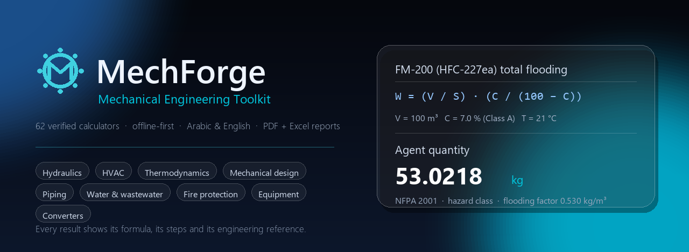
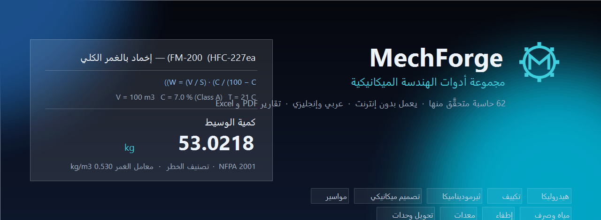
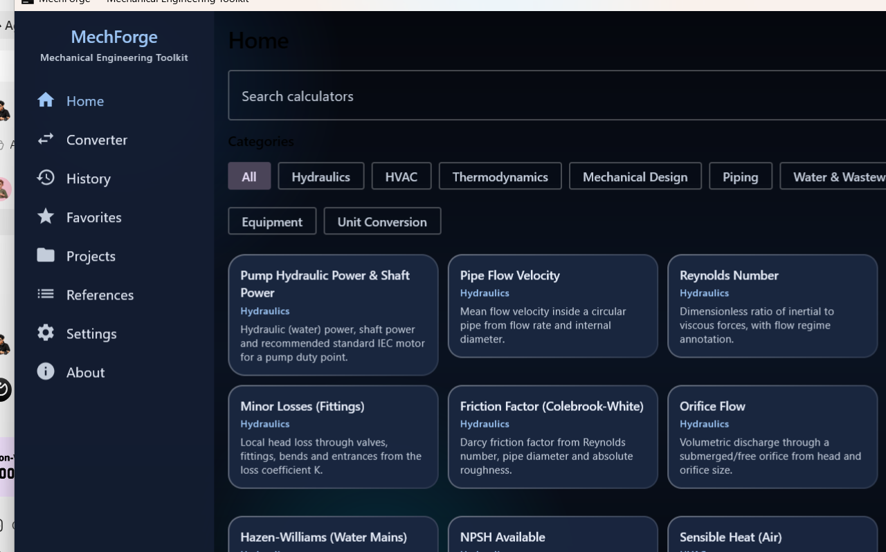
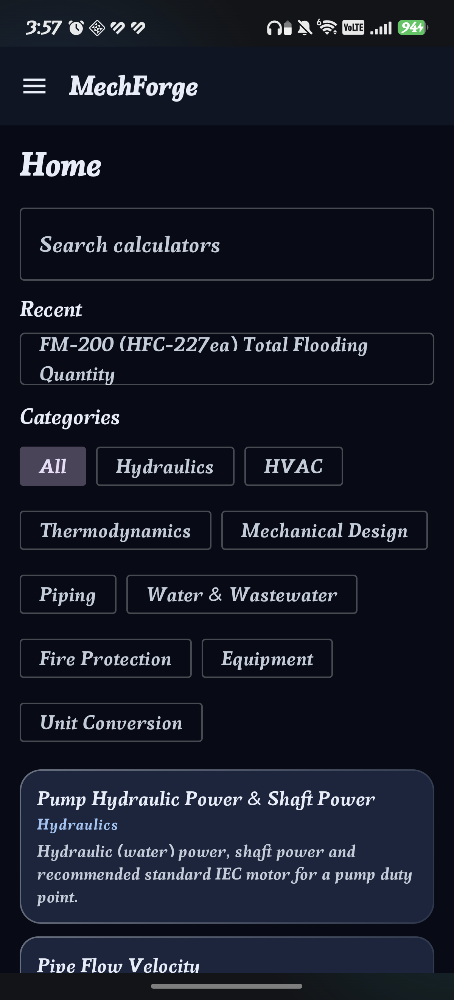
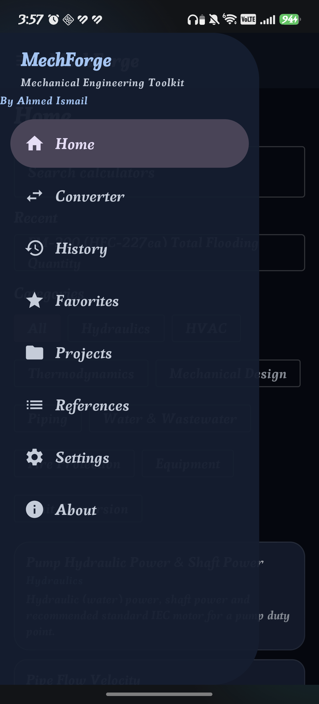
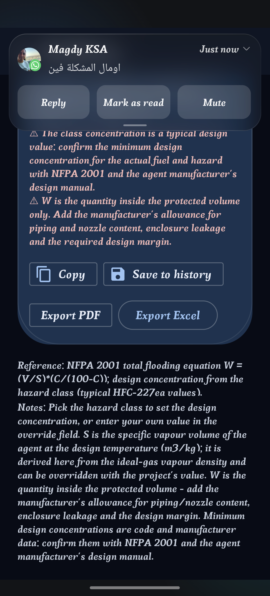

<div align="center">





**A local-first mechanical-engineering toolkit for engineers who need to check their numbers.**

Hydraulics · HVAC · Thermodynamics · Mechanical design · Piping · Water &amp; wastewater · Fire protection · Equipment




<p>
  
  
  
</p>

<sub>Desktop (above) and Android (below the same UI, glass theme): the calculator library, the navigation drawer and a calculation with its result and the export actions (PDF / Excel).</sub>

</div>

---

## Overview

MechForge is a mechanical-engineering calculator suite that runs **entirely on your device**.
It is built around one idea: an engineering number is only useful if you can check it, so
**every calculator shows its formula, its calculation steps and its engineering reference**
next to the result — never just a bare number.

- **62 calculators**, each with declared inputs, units, validation and references.
- **Offline-first**: no account, no telemetry, no network. The Android app declares **no
  INTERNET permission** at all.
- **Arabic and English interface**, with a **report language** that is chosen separately
  from the app language (Arabic reports are laid out right-to-left).
- **Engineering reports**: a paginated **PDF** and a formatted **Excel workbook** with the
  same block order — letterhead, inputs, formula, steps, results, warnings, notes,
  reference and a signature block.
- **One engine, two apps**: the same Kotlin Multiplatform engine and the same Compose UI
  are used by the Android app and the desktop (JVM) app.

## Calculator catalogue

| Category | Calculators | Examples |
| --- | --- | --- |
| Hydraulics | 10 | pump power, pipe velocity, Reynolds number, Darcy-Weisbach, friction factor, orifice flow, Manning, Hazen-Williams, NPSH available, minor losses |
| HVAC | 10 | sensible heat, total cooling load, airflow converter, kW ↔ TR / COP / EER, latent heat, duct velocity, duct sizing, duct friction loss, fan power, air changes per hour |
| Thermodynamics | 6 | ideal gas, Carnot efficiency, thermal efficiency, isentropic relations, compressor power, LMTD |
| Mechanical design | 8 | power ↔ torque ↔ speed, torsional stress, bolt torque and design preload, bearing life (L10 / Lnm), spring rate, simply supported beam, cantilever beam, gear ratio |
| Piping | 6 | pipe sizing, pipe weight (with content), wall thickness (ASME B31.3 form), thermal expansion, equivalent length, valve Kv / Cv |
| Water &amp; wastewater | 5 | tank volume, detention time, chlorine dose, peak flow, hydraulic loading |
| Fire protection | 7 | sprinkler discharge (K-factor), hose / nozzle flow, fire pump head, fire pump power, water hammer (Joukowsky), **FM-200 (HFC-227ea) total flooding**, **CO₂ total flooding (NFPA 12)** |
| Equipment | 5 | heat exchanger duty, effectiveness-NTU, pump affinity laws, fan laws, multi-stage compression ratio |
| Unit conversion | 5 | pressure, flow, power, length, temperature |

The fire-protection and equipment calculators are driven by the **hazard class** rather
than by a concentration the user has to look up: choose the class and the design
concentration, flooding factor, agent quantity and cylinder count follow (CO₂ uses the
standard 45 kg cylinder charge).

## Engineering reports

| | PDF | Excel (.xlsx) |
| --- | --- | --- |
| Layout | paginated A4 sheet with letterhead | one worksheet, styled sections |
| Content | inputs, formula, steps, results, warnings, notes, reference, signatures + "By Ahmed Ismail" | identical block order |
| Company logo | yes (uploaded in Settings) | — |
| Language | Arabic (right-to-left) or English, chosen in Settings | same, including the sheet direction |

Both renderers consume the same structured report model, so the two outputs can never
drift apart.

## Projects and document control

A calculation is not a loose form: it belongs to a project, and the project - not the settings -
owns the data a report prints.

- **Project record.** Each project carries its identification (number, code, type, location,
  country, client, consultant, contractor, end user), the engineering responsibility (prepared,
  checked and approved by, discipline), the document control (document number, revision, revision
  date, and a status of Draft, For Review, For Approval, Approved or As Built) and the design
  basis (applicable codes, code edition, design conditions, notes).
- **Active project.** The project a calculation is saved under. The project card marks it, the
  calculator reports it without any re-typing, and an installation with a single project picks
  the newest one automatically.
- **Frozen snapshot.** Saving a calculation stores the project data that was in force at that
  moment, so revising the project later cannot rewrite a calculation that was already issued:
  opening an old calculation prints the data frozen with it.
- **Calculation register.** Every project exports a register - number, calculator, revision,
  status, prepared by, date - with a status summary, to PDF or Excel.
- **Calculation package.** A cover with the project data, the register, then every calculation on
  a clean page, delivered as one PDF.
- **Report quality checks.** Before an export the app reports what is missing: no project, a
  project record that is still blank, no revision, an empty document status, a sheet that is not
  linked to a saved calculation, and how many values were assumed. The checks never block the
  export - the engineer decides what is good enough to issue.
- **Result versus approval.** A sheet states that the printed values are the calculation result,
  while design approval is a separate document action recorded in the project register.

## Reference library

Engineering data lives next to the calculator, not inside it:

- **Built-in generic datasets** (self-authored values only): typical pipe roughness,
  material densities, water properties, physical constants, IEC motor ratings.
- **Import your own** licensed data as **CSV** (`key,value,unit,notes`) or **JSON**
  (array of rows, or an object with `name`, `category`, `source`, `license` and `rows`).
- Every dataset carries its **source** and **licence**, and a dataset can **fill a
  calculator input** directly (for example the roughness dataset feeding ε).

## Documentation

- **[Technical reference](docs/MechForge-technical-reference.html)** &mdash; every calculator with its
  equation, inputs (units, validation, options), outputs, calculation logic, numeric constants and
  engineering references, plus the architecture, the unit families, the report pipeline and the build
  instructions. It is generated from the engine source, so it cannot drift:
  `python tools/docs/generate_reference.py`.
- The authoritative product specification is `MechForge_README_v2.md`.

## Verification

Correctness is treated as a first-class feature, and is checked twice:

1. **Unit tests** in the engine and the app: **259** engine tests (`:core:jvmTest`) plus
   **16** app tests (`:composeApp:desktopTest`) covering the database migrations, the
   reference-library import and the report renderers.
2. **An independent implementation**: `tools/verification/` re-derives the equations in
   Python from a dump of the engine's own output. The current run covers **129
   scenarios**, **433 result comparisons** and **all 62 calculators**, with **0 value
   mismatches** and **0 scaling-law failures**.

```bash
./gradlew :core:jvmTest :composeApp:desktopTest

# independent cross-check
python tools/verification/extract_dump.py core/build/test-results/jvmTest/TEST-com.mechforge.core.EngineOutputDumpTest.xml engine_dump.jsonl
python tools/verification/verify_calculations.py engine_dump.jsonl
```

## Architecture

```
core/         Kotlin Multiplatform engine: units, validation, 62 calculators (no UI or DB dependencies)
composeApp/   Compose Multiplatform app, shared by both platforms
              commonMain/   shared UI, data layer, report model
              androidMain/  Android entry point, manifest, icons, SQLite driver
              desktopMain/  desktop entry point, SQLite driver, native file dialogs
docs/         decision records (ADR style) and image assets
tools/        verification tooling (not shipped with the app)
```

Rules the codebase keeps to:

- Engineering formulas live **only** in `core` (`com.mechforge.core.calcs`); the UI never
  performs engineering math.
- Every calculator declares its formula, reference, assumptions and validation, and takes
  at least three tests (textbook case, unit-conversion case, edge case).
- No copyrighted standard tables are embedded: the tools compute, cite and let you import
  licensed data — they do not certify code compliance.

## Build and run

Requirements: a **JDK 17+** through `JAVA_HOME` (the Android Studio JBR works), and for
the Android target the Android SDK (via `ANDROID_HOME`, or `sdk.dir` in the gitignored
`local.properties`).

```bash
# desktop app
./gradlew :composeApp:run

# Android app on a connected phone
./gradlew :composeApp:installDebug

# tests
./gradlew :core:jvmTest :composeApp:desktopTest

# signed release APK (uses signing/keystore.properties, which is gitignored)
./gradlew :composeApp:assembleRelease
```

On Windows, `run-mechforge.bat` starts the desktop app with the JBR already set.

### Desktop package (Windows .exe)

```bash
# jpackage (a full JDK 17+, or a JetBrains Runtime 21+) must be the active JAVA_HOME
./gradlew :composeApp:createDistributable
```

The result is a self-contained app image at
`composeApp/build/compose/binaries/main/app/MechForge/`, with `MechForge.exe` next to a
bundled runtime - no Java installation is needed on the target machine. Two notes:

- The app persists through SQLite over JDBC, so the trimmed runtime must carry
  `java.sql`; that is declared in `nativeDistributions { modules(...) }`. Without it the
  packaged app dies at startup with `NoClassDefFoundError: java/sql/DriverManager`.
- `Msi` output additionally needs the WiX toolset; the `Exe` app image does not.

## Data and privacy

- Desktop database: `~/.mechforge/mechforge.db` (history, favourites, projects, settings,
  the calculator and unit registries).
- On Android it lives in the app's private storage and disappears when the app is
  uninstalled.
- Nothing leaves the device. The Android app requests **no INTERNET permission**; the only
  declared permission is `POST_NOTIFICATIONS`, used solely for the "report exported"
  notification.

## Roadmap

- Arabic content for the calculators themselves (names, descriptions, notes and steps are
  English in this phase; the interface and the reports are already fully bilingual).
- More fire-protection depth (CO₂ pipe/nozzle sizing and venting), and additional
  equipment calculators.
- Desktop packaging (`jpackage`) and a published release with installable artefacts.
- **Live Excel formulas** in the exported workbook: the formula and the steps are already
  written into the sheet, but a *live* formula needs the sheet cells to carry the units
  the engine converts to SI internally, and there is no spreadsheet engine in this
  environment to evaluate the templates - so it is planned as its own change with tests
  rather than shipped unverified.

## License and credits

- **MIT License** — see [LICENSE](LICENSE) (Copyright (c) 2026 Ahmed Ismail). Change it if
  you prefer another licence.
- The application embeds **no copyrighted standard tables**; formulas are implemented and
  cited, and licensed data is imported by the user.
- Built by **Ahmed Ismail**.

---

<sub>MechForge 0.2.0 · this file is the project overview; the authoritative product
specification lives in <code>MechForge_README_v2.md</code>.</sub>
